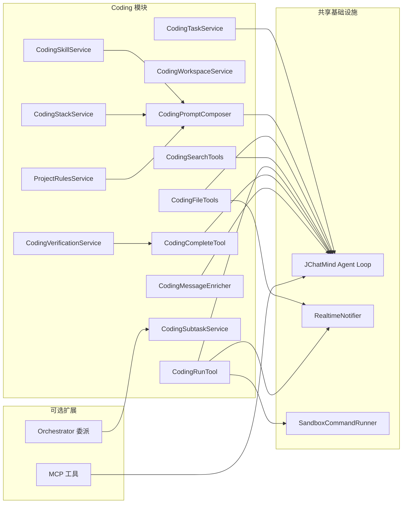
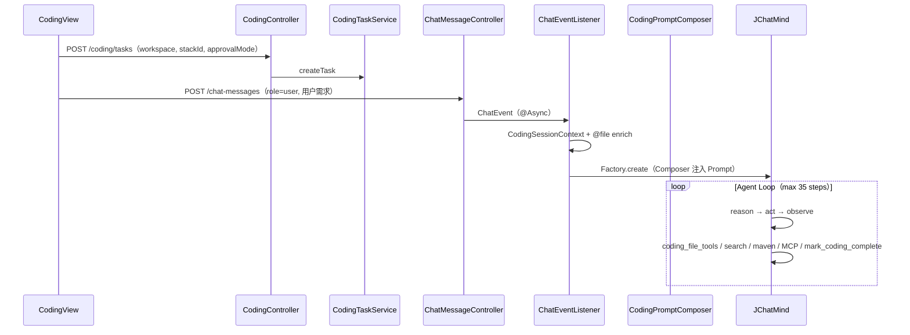
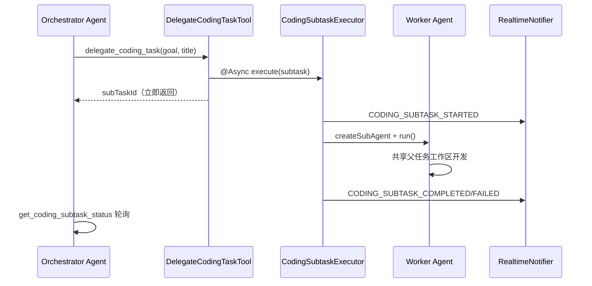
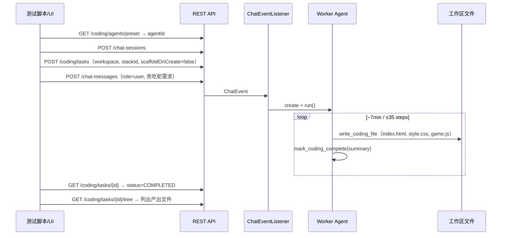

# Phase 3 — AI Coding 模块设计

> 上级文档：[architecture.md](./architecture.md)  
> 状态：**已实现**（Claude Code 工作台 + Orchestrator/Worker + 栈感知验证 + 交付钩子）  
> 最后更新：2026-06-02

---

## 1. 模块目标

在 JChatMind 之上提供 **仿 Claude Code** 的网页 AI 编程能力：

- 绑定本地/服务端工作区（Maven / Python / Node / 纯静态 HTML）
- Agent **自主**完成：建文件 → 写代码 → 验证 → 读报错 → 修复 → 交付
- 三栏 UI：文件树 | 预览/Diff | 对话 + 子任务面板 | 底部终端 + 验证条
- 可配置 **Skill**、**Stack Profile**、**项目规则**、**审批模式**、**MCP** 扩展
- **Orchestrator** 可委派子任务给 **Worker** 异步执行

---

## 2. 模块边界



**不在本模块内**

- 通用聊天（`controller` + `AgentChatView`）
- Memory Hub / 知识库 RAG（可叠加，非 Coding 专有）

---

## 3. 目录结构（当前）

```
coding/
├── config/CodingProperties.java
├── context/
│   ├── CodingSessionContext.java
│   └── SubAgentRunContext.java
├── controller/
│   ├── CodingController.java           # /api/coding/tasks
│   ├── CodingSubtaskController.java    # subtasks + runtime-status
│   ├── CodingWorkspaceController.java
│   └── CodingSkillController.java
├── service/
│   ├── CodingTaskService
│   ├── CodingWorkspaceService
│   ├── CodingPromptComposer            # Prompt 组装（从 Factory 抽出）
│   ├── CodingSkillService / CodingStackService
│   ├── CodingCommandService            # Maven + Shell 沙箱
│   ├── CodingVerificationService       # 交付验证记录
│   ├── CodingApprovalService / CodingApprovalPolicy
│   ├── CodingSubtaskService / CodingSubtaskExecutor
│   ├── CodingMessageEnricher
│   ├── ProjectRulesService
│   ├── AgentPresetBootstrapService
│   └── SandboxCommandRunner
├── bridge/CodingMcpOutputBridge.java
├── registry/CodingChangeRegistry.java
└── model/entity|dto|enums

agent/tools/coding/
├── CodingFileTools.java                # coding_file_tools
├── CodingSearchTools.java              # coding_search_tools
├── CodingRunTool.java                  # maven_command
├── CodingCompleteTool.java             # mark_coding_complete
├── DelegateCodingTaskTool.java         # delegate_coding_task
└── CodingSubtaskQueryTool.java         # coding_subtask_tools

resources/
├── coding-skills/*.json
├── coding-stacks/*.json                # 含 verifyCommands
├── coding-templates/{stackId}/
├── coding-agent-preset.json
└── coding-orchestrator-preset.json
```

---

## 4. 核心流程

### 4.1 创建任务 → 对话 → Agent 闭环



### 4.2 Orchestrator 委派子任务



**循环依赖处理**：`CodingSubtaskExecutorImpl` 对 `JChatMindFactory` 使用 `@Lazy` 注入。

### 4.3 文件写入 → 前端 Diff + 验证失效

1. Agent 调用 `write_coding_file` 或 `apply_coding_patch`
2. 写入 → SSE `CODING_FILE_CHANGED`（含 old/new 摘要）
3. `CodingVerificationService.invalidate(taskId)` — 改代码后须重新验证
4. `CodingView` 刷新文件树、打开 Diff Tab

### 4.4 命令执行 → 验证记录

| 来源 | 成功 exit 0 时 |
|------|----------------|
| `maven_command` / `POST run-maven` | `CodingCommandService` → `recordSuccess` |
| `POST run-shell` | 同上 |
| MCP 终端工具 | `CodingMcpOutputBridge` → `recordSuccess` |

需审批的 Maven → `WAITING_APPROVAL` + SSE `CODING_APPROVAL_REQUIRED` → 底部审批条。

### 4.5 交付闭环

1. Agent 调用 `mark_coding_complete(summary)`
2. `CodingVerificationService.validateBeforeComplete`（`require-verification=true` 时）
3. 通过 → `CodingTaskService.completeTask` + SSE `CODING_COMPLETED`
4. 前端 `CodingCompletionCard` 展示变更文件与运行说明

---

## 5. Agent 集成点

### 5.1 JChatMindFactory

有活动 Coding 任务时：

| 注入项 | 来源 |
|--------|------|
| System Prompt 增强 | **`CodingPromptComposer.composeSystemPrompt()`** |
| maxSteps | `coding.agent.max-loop-steps`（默认 35） |
| 子 Agent | `createSubAgent()` — Worker 专用，共享父会话工作区 |

Factory **不再**内联 rules/skill/stack 逻辑（阶段 B 已抽出）。

### 5.2 CodingPromptComposer

组装顺序：

1. Agent 基础 systemPrompt
2. 项目规则（任务工作区 `JCHATMIND.md` / `CLAUDE.md` / `AGENTS.md`）
3. Skill 指令（metadata.skillId 或栈默认 skillId）
4. Coding 自主开发协议（栈 verifyWorkflow、推荐工具、交付标准）

### 5.3 ChatEventListener

```text
CodingSessionContext.set(sessionId, agentId)
→ markRunning（PENDING 任务）
→ CodingMessageEnricher.enrichUserMessage（@file）
→ JChatMindFactory.create(..., enrichedInput)
→ JChatMind.run()
→ CodingSessionContext.clear()
```

### 5.4 Agent 预设与工具

**Worker**（`coding-agent-preset.json`）

| 工具名 | 说明 |
|--------|------|
| `coding_file_tools` | 读/写/列目录 |
| `coding_search_tools` | grep + patch |
| `maven_command` | Java 降级验证 |
| `mark_coding_complete` | 交付 |
| MCP 终端 | `run_terminal_cmd` / `bash` / `shell` |

**Orchestrator**（`coding-orchestrator-preset.json`）

| 工具名 | 说明 |
|--------|------|
| `delegate_coding_task` | 委派子任务 |
| `coding_subtask_tools` | 查询子任务状态 |

---

## 6. 工具规格

### 6.1 coding_file_tools

| 方法 | 说明 |
|------|------|
| `read_coding_file(relativePath)` | 读文件 |
| `write_coding_file(relativePath, content)` | 写文件；触发 Diff SSE + invalidate 验证 |
| `list_coding_directory(relativePath)` | 列目录 |

### 6.2 coding_search_tools

| 方法 | 说明 |
|------|------|
| `search_coding_files(query, glob)` | 工作区内文本搜索 |
| `apply_coding_patch(relativePath, oldText, newText)` | 局部替换；invalidate 验证 |

### 6.3 maven_command

| goal | 命令 | development 模式 |
|------|------|-------------------|
| `compile` | mvn compile | 自动 |
| `test` | mvn test | 自动 |
| `test_single` | mvn test -Dtest= | 自动 |
| `clean_compile` / `clean_test` | 对应 mvn | 自动 |
| `package_skip_tests` | mvn package -DskipTests | 需 strict 或人工 |

### 6.4 mark_coding_complete

- 参数：`summary`（须含改了哪些文件、如何运行）
- 前置：`require-verification=true` 时须有 exit 0 验证记录
- 效果：任务 `COMPLETED` + `CODING_COMPLETED` SSE

---

## 7. Stack Profile 与 verifyCommands

**路径**：`classpath:coding-stacks/*.json`

| id | 语言 | verifyCommands 示例 |
|----|------|---------------------|
| `java-maven` | Java | `mvn compile`, `mvn test` |
| `python-pytest` | Python | `pytest -q`（shell） |
| `node-npm` | JavaScript | `npm test`（shell） |

前端「验证」面板按栈 `verifyCommands` 渲染按钮，调用 `run-maven` 或 `run-shell`。

纯 HTML/JS（无 package.json）可选手动选空工作区 + Worker Agent；栈可任意，验证依赖 MCP 或关闭 `require-verification`。

---

## 8. Skill 系统

**路径**：`classpath:coding-skills/*.json`

| id | 用途 |
|----|------|
| `java-autonomous-dev` | 通用 Java 自主开发 |
| `python-autonomous-dev` | Python |
| `node-autonomous-dev` | Node.js |
| `java-snake-game` | 贪吃蛇示例 |

**扩展**：新增 JSON 后重启；`GET /api/coding/skills`。

---

## 9. 审批模式

| 模式 | 行为 |
|------|------|
| `strict` | 仅 `compile` 自动 |
| `development`（**默认**） | compile / test / test_single / clean_* 自动 |
| `trusted` | 全部白名单 Maven 自动 |

优先级：**任务 metadata.approvalMode** > `coding.approval.default-mode`

---

## 10. 项目规则与 @file

规则文件（任务工作区根）：`JCHATMIND.md` → `CLAUDE.md` → `AGENTS.md`，截断 `max-chars`。

@file 由 `CodingMessageEnricher` 展开为 `<file path="...">...</file>`；前端 `CodingChatInput` 支持插入当前选中路径。

---

## 11. REST API

| 方法 | 路径 | 说明 |
|------|------|------|
| POST | `/api/coding/tasks` | 创建任务 |
| GET | `/api/coding/tasks/{id}` | 任务详情 |
| GET | `/api/coding/tasks/session/{sessionId}/active` | 活动任务 |
| GET | `/api/coding/tasks/{id}/summary` | 交付摘要 |
| GET | `/api/coding/tasks/{id}/tree?path=.` | 文件树 |
| GET | `/api/coding/tasks/{id}/file?path=` | 读文件预览 |
| POST | `/api/coding/tasks/{id}/run-maven` | 手动 Maven |
| POST | `/api/coding/tasks/{id}/run-shell` | 手动 Shell（栈 verifyCommands） |
| POST | `/api/coding/tasks/{id}/approve` / `reject` | Maven 审批 |
| GET | `/api/coding/tasks/session/{sessionId}/subtasks` | 子任务列表 |
| GET | `/api/coding/runtime-status` | MCP 开关、交付验证开关 |
| GET | `/api/coding/stacks` | 技术栈 + verifyCommands |
| GET | `/api/coding/workspaces` | 工作区白名单 |
| GET | `/api/coding/agents/preset` | Worker Agent |
| GET | `/api/coding/agents/orchestrator-preset` | Orchestrator Agent |

**发消息注意**：`POST /api/chat-messages` 的 `role` 须为枚举小写 `"user"`，不能写 `"USER"`。

---

## 12. SSE 事件（Coding 相关）

| 类型 | 触发时机 |
|------|----------|
| `CODING_STARTED` | 任务创建 |
| `CODING_FILE_CHANGED` | write / patch |
| `CODING_APPROVAL_REQUIRED` | Maven 需审批 |
| `CODING_COMMAND_OUTPUT` | Maven / Shell / MCP 终端输出 |
| `CODING_SCAFFOLD_DONE` | 脚手架就绪 |
| `CODING_SUBTASK_STARTED/COMPLETED/FAILED` | 子任务生命周期 |
| `CODING_COMPLETED` / `CODING_FAILED` | 任务终态 |

与 Agent 通用事件（`AI_PLANNING` … `AI_DONE`）在同一条 SSE 连接推送；推送统一经 `RealtimeNotifier.tryPublish()`。

---

## 13. 前端组件

| 组件 | 职责 |
|------|------|
| `CodingView` | 工作台、创建向导、SSE 分发、验证面板、MCP 状态 Tag |
| `CodingFileTree` | 懒加载文件树 |
| `CodingFilePreview` | 预览 / Diff |
| `CodingTerminalPanel` | 日志 + 审批条 |
| `CodingChatInput` | 对话 + @文件 |
| `CodingSubtaskPanel` | Orchestrator 子任务列表 |
| `CodingCompletionCard` | 交付摘要卡片 |
| `useSessionSse` | SSE 订阅 hook（`api/sse.ts`） |

路由：`/coding`（创建）→ `/coding/:sessionId`（工作台）。

---

## 14. 配置参考

```yaml
spring:
  main:
    allow-circular-references: true

coding:
  workspace:
    root: ./workspace
    allowed-roots:
      - name: Snake E2E 测试
        path: Z:/.../jchatmind/workspace/snake-e2e
  agent:
    max-loop-steps: 35
  approval:
    default-mode: development
  delivery:
    require-verification: true   # 纯 HTML 无 MCP 时可临时 false
  subagent:
    enabled: true
    worker-agent-name: Claude Code Coding Agent
  orchestrator-preset:
    enabled: true
  agent-preset:
    enabled: true
```

---

## 15. 数据库

**表**：`t_coding_task`

| 字段 | 说明 |
|------|------|
| id | UUID |
| session_id | 绑定聊天会话 |
| agent_id | Agent |
| status | pending / running / waiting_approval / completed / … |
| workspace_root / workspace_path | 工作区 |
| metadata | JSON：stackId, skillId, language, approvalMode |
| result_summary | 交付摘要或最近命令输出 |

**子任务**：当前为内存注册表（`CodingSubtaskServiceImpl`），无 DB 持久化。

---

## 16. 已实现 vs 待办

| 项 | 状态 |
|----|------|
| 三栏工作台 + Diff SSE | ✅ |
| Agent 推理-工具-观察闭环 | ✅ |
| Skill + Stack Profile + 脚手架/检测 | ✅ |
| Orchestrator + Worker 异步子 Agent | ✅ |
| CodingPromptComposer 抽出 | ✅ |
| coding_search_tools（grep/patch） | ✅ |
| 交付验证钩子（require-verification） | ✅ |
| 栈感知验证 UI + MCP 状态 | ✅ |
| CodingSubtaskPanel + REST | ✅ |
| run-shell API | ✅ |
| RealtimeNotifier 统一 SSE | ✅ |
| mark_coding_complete + 交付摘要 | ✅ |
| @file 引用 + 项目规则 | ✅ |
| 子任务 DB 持久化 | ⬜ |
| 纯 HTML Stack Profile | ⬜ |
| Agent 侧通用 shell 工具（非 REST） | ⬜ |
| Skill 管理 UI | ⬜ |

联调文档：[`Coding_Setup.md`](Coding_Setup.md)

---

## 19. 端到端测试案例（贪吃蛇 HTML/JS/CSS）

### 19.1 测试目标

验证 **Worker Agent** 能否从用户自然语言需求出发，自主写代码并交付可运行产品（无需 Orchestrator 拆任务）。

### 19.2 环境准备

1. PostgreSQL、`jchatmind` 库可连
2. 后端 `:8080`、前端 `:5173`（`npm run dev`）
3. 工作区：`jchatmind/workspace/snake-e2e/`（已加入 `allowed-roots`）
4. 选用 **Worker** Agent（`GET /api/coding/agents/preset`）
5. 纯静态 HTML 测试时：MCP 默认关闭 → 建议临时 `coding.delivery.require-verification: false`

### 19.3 API 调用序列



### 19.4 用户 Prompt 示例

```text
请用 HTML + CSS + JavaScript 在当前工作区实现一个可在浏览器中直接打开的贪吃蛇游戏。
要求：1) index.html 作为入口；2) 独立 style.css 和 game.js；
3) 键盘方向键控制，有得分和重新开始；4) 写完后调用 mark_coding_complete，summary 说明如何打开游玩。
```

### 19.5 实测结果（2026-06-02）

| 项 | 值 |
|----|-----|
| sessionId | `e80ec3d5-d2c8-4a99-ab40-9a3047eb1f99` |
| taskId | `f5c46f34-fd20-4158-ad81-679e0abc6aa7` |
| 最终状态 | **COMPLETED** |
| 产出文件 | `index.html`、`style.css`、`game.js` |
| 功能 | Canvas 20×20、方向键、得分/最高分(localStorage)、Game Over 弹窗、重新开始 |
| 耗时 | ~7 分钟 |
| 验证方式 | 双击 `index.html` 浏览器打开 |

### 19.6 踩坑记录

| 现象 | 原因 | 处理 |
|------|------|------|
| 应用无法启动 | Factory ↔ SubtaskExecutor 循环依赖 | `@Lazy JChatMindFactory` + `allow-circular-references` |
| 发消息后 Agent 无响应 | `role: "USER"` 反序列化失败 | 必须用小写 `"user"` |
| mark_coding_complete 被拒 | 无 MCP 时无法 recordSuccess | 纯 HTML 测试临时 `require-verification: false` |
| 任务 status 轮询为空 | 任务 COMPLETED 后无 active 任务 | 改查 `GET /coding/tasks/{id}` |

### 19.7 UI 复现步骤

1. 打开 `http://localhost:5173/coding`
2. 工作区选 **Snake E2E 测试**，Agent 选 **Worker**
3. 发送 §19.4 同款 Prompt
4. 观察：文件树出现三文件、终端有 Agent 日志、完成后出现交付卡片
5. 本地打开 `workspace/snake-e2e/index.html` 试玩

### 19.8 PowerShell 快速脚本（节选）

```powershell
$base = "http://localhost:8080/api"
$preset = Invoke-RestMethod "$base/coding/agents/preset"
$agentId = $preset.data.agentId

$session = Invoke-RestMethod "$base/chat-sessions" -Method Post `
  -Body (@{ agentId = $agentId; title = "Snake E2E" } | ConvertTo-Json) `
  -ContentType "application/json"
$sessionId = $session.data.chatSessionId

$task = Invoke-RestMethod "$base/coding/tasks" -Method Post `
  -Body (@{
    sessionId = $sessionId; agentId = $agentId
    workspaceRoot = "Z:/JAVA_workshop/JChatMindv2/JChatMind/jchatmind/workspace/snake-e2e"
    workspacePath = "."; approvalMode = "development"; scaffoldOnCreate = $false
  } | ConvertTo-Json) -ContentType "application/json"

Invoke-RestMethod "$base/chat-messages" -Method Post `
  -Body (@{
    agentId = $agentId; sessionId = $sessionId; role = "user"
    content = "请用 HTML+CSS+JS 写贪吃蛇…（见 §19.4）"
  } | ConvertTo-Json) -ContentType "application/json; charset=utf-8"
```
