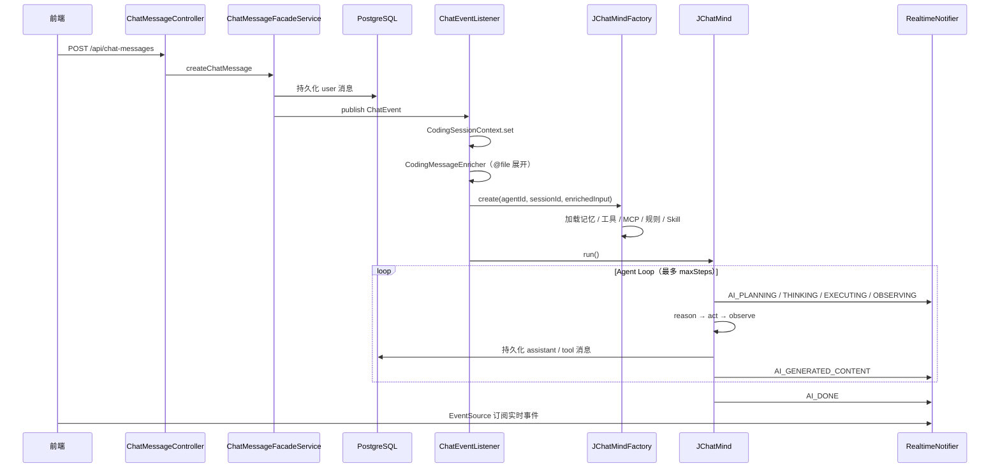

# JChatMind 软件架构文档

> 版本：2026-06-02（Phase 3 — Claude Code 式 AI Coding + Orchestrator/Worker + 交付验证）  
> 代码根目录：`JChatMind/jchatmind`（后端）、`JChatMind/ui`（前端）

---

## 1. 系统定位

JChatMind 是基于 **Spring Boot 3.5.x** + **Spring AI 1.1.x** 的多智能体对话与 AI 编程平台，核心能力包括：

| 能力 | 说明 | 默认开关 |
|------|------|----------|
| 多 Agent 对话 | 可配置模型、系统提示词、可选工具 | 常开 |
| Agent 工具闭环 | 推理 → 工具调用 → 结果观察 → 继续推理 | 常开 |
| 知识库 RAG | 文档上传、分块、向量检索 | 常开 |
| Memory Hub | 分层记忆（WORKING / RECENT / ARCHIVE） | `memory.hub.enabled=false` |
| MCP 工具 | 通过 mcp-proxy-server 接入外部 MCP 工具 | `mcp.enabled=false` |
| AI Coding | 仿 Claude Code 的工作台：文件树、预览/Diff、对话、终端、子任务、栈感知验证 | 常开（需创建 Coding 任务） |
| Orchestrator/Worker | 编排 Agent 委派子任务，Worker 异步执行 | `coding.subagent.enabled=true` |

---

## 2. 仓库与部署视图

```
JChatMindv2/
├── pom.xml                          # 聚合 POM（IDEA 多模块）
├── JChatMind/
│   ├── jchatmind/                   # Spring Boot 后端 (:8080)
│   │   └── src/main/
│   │       ├── java/com/kama/jchatmind/
│   │       ├── resources/
│   │       │   ├── application.yaml
│   │       │   ├── mapper/          # MyBatis XML
│   │       │   └── coding-skills/   # Skill JSON
│   │       └── out/                 # 架构文档（本目录）
│   └── ui/                          # React + Vite 前端 (:5173 dev)
│       └── src/
└── workspace/                       # Coding 默认沙箱（可配置）
```

**运行时依赖**

- PostgreSQL（`jchatmind` 库，可选 pgvector）
- LLM：DeepSeek / 智谱 GLM（`application.yaml` 配置）
- 可选：Ollama（Memory Hub 向量 `bge-m3`）、mcp-proxy-server

---

## 3. 技术栈

| 层级 | 技术 |
|------|------|
| 后端框架 | Spring Boot 3.5.8、Spring AI 1.1.0 |
| 持久化 | PostgreSQL、MyBatis、JSONB、pgvector |
| 异步 | `@EnableAsync`、`@EnableScheduling`（`AsyncConfig`） |
| 实时推送 | `ChatEventPublisher`（local 直推 SSE / rocketmq 经 MQ 桥接 SSE） |
| 前端 | React 19、Vite、Ant Design 6、@ant-design/x、Tailwind 4、React Router 7 |

---

## 4. 逻辑架构总览

```mermaid
flowchart TB
  subgraph Frontend["前端 ui/"]
    AgentView[AgentChatView]
    KBView[KnowledgeBaseView]
    CodingView[CodingView 三栏工作台]
  end

  subgraph API["REST / SSE"]
    REST["/api/*"]
    SSE["/sse/connect/{sessionId}"]
  end

  subgraph Core["核心域 service + controller"]
    Facade[Facade Services]
    ChatEvt[ChatEvent → ChatEventListener]
  end

  subgraph AgentLayer["Agent 层"]
    Factory[JChatMindFactory]
    Composer[CodingPromptComposer]
    Mind[JChatMind Agent Loop]
    SubExec[CodingSubtaskExecutor]
  end

  subgraph Vertical["垂直模块（opt-in）"]
    Memory[Memory Hub]
    MCP[MCP Bridge]
    Coding[Coding 模块]
  end

  subgraph Data["PostgreSQL"]
    CoreTables[agent / chat_* / kb / document]
    MemTables[t_memory_*]
    McpTables[t_mcp_tool_call]
    CodTables[t_coding_task]
  end

  Frontend --> REST
  Frontend --> SSE
  REST --> Facade
  Facade --> ChatEvt
  ChatEvt --> Factory --> Mind
  Factory --> Composer
  Factory --> Memory
  Factory --> MCP
  Factory --> Coding
  SubExec -.->|@Lazy| Factory
  Mind --> SSE
  Facade --> Data
  Vertical --> Data
```

---

## 5. 后端包结构

`com.kama.jchatmind` 共 14 个顶层包：

| 包 | 职责 |
|----|------|
| `agent` | `JChatMind` 运行时、`JChatMindFactory`、内置 `Tool` |
| `controller` | 核心 REST：Agent、会话、消息、知识库、文档、工具、SSE |
| `service` | Facade 门面（CRUD、RAG、SSE、邮件） |
| `model` | entity / dto / vo / request / response |
| `mapper` | 核心域 MyBatis |
| `converter` | Entity ↔ DTO ↔ VO |
| `event` | `ChatEvent` + `ChatEventListener` |
| `message` | `SseMessage` 协议 |
| `config` | ChatClient、CORS、Async |
| `memory` | Memory Hub 全模块 |
| `mcp` | MCP 客户端桥接与调用埋点 |
| `coding` | AI Coding 任务、工作区、Skill、审批、命令执行 |
| `exception` | `GlobalExceptionHandler` |
| `typehandler` | `StringListTypeHandler`、`PgVectorTypeHandler` |

---

## 6. 核心请求生命周期（对话）



**要点**

1. 用户消息先入库，再异步触发 Agent（`ChatEventListener` `@Async`）。
2. Agent **不**使用 Spring AI 内置自动工具执行（`internalToolExecutionEnabled=false`），由 `JChatMind` 手动控制工具顺序与持久化。
3. 前端通过 **同一会话** 的 SSE 连接接收 AI 与 Coding 事件。

---

## 7. Agent 层

### 7.1 JChatMind — Agent 闭环

旧称 Think–Execute，现实现为显式四阶段（Claude Code / ReAct 风格）：

| 阶段 | 方法 | AgentState | SSE |
|------|------|------------|-----|
| 规划 | `run()` 入口 | `PLANNING` | `AI_PLANNING` |
| 推理 | `reason()` | `THINKING` | `AI_THINKING` |
| 工具调用 | `act()` | `EXECUTING` | `AI_EXECUTING` |
| 结果观察 | `observe()` | `OBSERVING` | `AI_OBSERVING` |
| 结束 | `run()` finally | `FINISHED` / `ERROR` | `AI_DONE` |

单轮 `loopStep()`：**推理 →（若有 tool_calls）工具调用 → 观察 → 下一轮推理**，直到：

- 模型返回无 tool_calls 的最终回复，或
- 达到 `maxSteps`（普通对话默认 20，Coding 任务默认 35），或
- 调用 `terminate` 工具。

**消息窗口**

- `AgentDTO.ChatOptions.messageLength`：Agent 默认条数窗口（默认 10）。
- `coding.agent.memory-window`（默认 80）：Coding 任务活跃或子 Agent 时，与 `messageLength` 取 `max` 作为实际窗口。
- `ToolAwareMessageWindowChatMemory`：按 **tool 调用轮次**（assistant+tool_calls + 连续 tool 响应）整轮淘汰，钉住 system + 首条 user；`coding.agent.tool-aware-memory: true` 启用（false 回退 `MessageWindowChatMemory`）。
- `sanitizeMessagesForToolCallingApi()`：最后一道防线，清理仍不完整的 tool 链，避免 OpenAI/DeepSeek 400。
- 带 `tool_calls` 的 assistant 必须在对应 tool 消息持久化 **之后** 才推送前端。

### 7.2 JChatMindFactory — 装配

创建 Agent 时按顺序注入：

1. **Agent 配置**（DB `agent` 表 → `AgentDTO`）
2. **记忆**（Memory Hub 优先，否则 `chat_message` 最近 N 条）
3. **知识库列表**（`allowedKbs` → 供推理 prompt 引用）
4. **本地工具**（`ToolFacadeService` FIXED + `allowedTools` OPTIONAL）
5. **MCP 工具**（`mcp.enabled=true` 时按白名单追加）
6. **System Prompt 增强**（有 Coding 任务时，委托 `CodingPromptComposer`）：
   - 任务工作区 **项目规则**（`JCHATMIND.md` / `CLAUDE.md` / `AGENTS.md`）
   - **Skill** 指令（`coding-skills/*.json` 或栈默认 skillId）
   - **Coding 自主开发协议**（栈 Profile、推荐工具、验证/交付说明）
7. **Coding 步数**：活动任务存在时 `maxSteps = coding.agent.max-loop-steps`（默认 35）
8. **消息窗口**：Coding/子 Agent 使用 `max(messageLength, memory-window)` + `ToolAwareMessageWindowChatMemory`

**循环依赖说明**：`CodingSubtaskExecutorImpl` 通过 `@Lazy JChatMindFactory` 注入，避免与 `ToolFacade → DelegateCodingTaskTool` 形成启动死锁；`spring.main.allow-circular-references: true` 作为兜底。

### 7.3 AgentState

```
IDLE → PLANNING → THINKING ⇄ EXECUTING → OBSERVING → … → FINISHED / ERROR
```

---

## 8. 工具系统

### 8.1 本地 Tool 架构

```
Tool (interface)
  ├── ToolType.FIXED    → 所有 Agent 强制拥有（如 TerminateTool）
  └── ToolType.OPTIONAL → 由 Agent.allowedTools 勾选
```

| 工具名 | 类 | 用途 |
|--------|-----|------|
| `knowledge` | `KnowledgeTools` | RAG 检索 |
| `email` | `EmailTools` | 发邮件 |
| `filesystem` | `FileSystemTools` | 通用文件（非 Coding 沙箱） |
| `database` | `DataBaseTools` | SQL 查询 |
| `direct_answer` | `DirectAnswerTool` | 直接回答 |
| `terminate` | `TerminateTool` | 结束 Agent 循环 |
| `coding_file_tools` | `CodingFileTools` | Coding 工作区读/写/列目录；写文件 invalidate 验证记录 |
| `coding_search_tools` | `CodingSearchTools` | 工作区内 grep + 局部 patch |
| `maven_command` | `CodingRunTool` | Maven 白名单命令 |
| `mark_coding_complete` | `CodingCompleteTool` | 验证通过后标记交付 |
| `delegate_coding_task` | `DelegateCodingTaskTool` | Orchestrator 委派子任务 |
| `coding_subtask_tools` | `CodingSubtaskQueryTool` | 查询/列出子任务状态 |
| `weather` / `date` / `city` | test 包 | 示例工具（OPTIONAL） |

**注册方式**：`@Component` + `@Tool` 注解；`JChatMindFactory` 通过 `MethodToolCallbackProvider` 转为 `ToolCallback`。

### 8.2 MCP 工具（opt-in）

- **连接**：Spring AI `McpSyncClient` → `spring.ai.mcp.client.sse.connections`
- **桥接**：`McpToolBridgeImpl` + `SyncMcpToolCallbackProvider`
- **埋点**：`RecordingToolCallback` → 异步写入 `t_mcp_tool_call`
- **注入**：`McpIntegrationImpl.getToolsForAgent(allowedTools)` 白名单匹配
- **容错**：MCP 连接失败或工具为空时静默跳过，不影响主流程

---

## 9. Memory Hub（opt-in）

**配置前缀**：`memory.hub.*`（默认 `enabled=false`）

### 9.1 分层模型

| 层级 | 类型 | 策略 |
|------|------|------|
| WORKING | 短期 | 滑动窗口，原始对话 |
| RECENT | 中期 | 重要性评分 Top-N |
| ARCHIVE | 长期 | 摘要 + 向量检索（pgvector + bge-m3） |

### 9.2 与 Agent 集成

- `MemoryIntegration.buildContext(sessionId, maxTokens)` → `List<Message>`
- `JChatMindFactory.loadMemory()`：Hub 有数据则优先，否则回退 `chat_message`
- 离线评测：`src/test/java/.../eval/`（清晰率、召回率、重复率等）

### 9.3 主要表

`t_memory_entry`、`t_memory_embedding`、`t_memory_context`、`t_memory_session`、`t_memory_task`、`t_memory_stats`

---

## 10. AI Coding 模块

> 详细设计见同目录 [`Phase3_架构设计.md`](Phase3_架构设计.md)

### 10.1 产品形态

仿 **Claude Code** 的三栏工作台（`CodingView`）：

```
┌──────────┬─────────────────┬──────────────┐
│ 文件树   │ 预览 / Diff     │ Agent 对话   │
│          │                 │ + 子任务面板 │
├──────────┴─────────────────┴──────────────┤
│ 终端 + 栈感知验证条 + Maven 审批条        │
└───────────────────────────────────────────┘
```

**双 Agent 模式**

| 模式 | 预设 | 适用 |
|------|------|------|
| **Worker**（默认推荐单任务） | Claude Code Coding Agent | 单 Agent 直连开发（HTML/JS、小功能） |
| **Orchestrator** | Claude Code Orchestrator | 复杂需求拆分子任务异步委派 |

### 10.2 后端子模块

| 组件 | 说明 |
|------|------|
| `CodingTaskService` | 任务生命周期；Maven 后保持 `RUNNING` 以支持多轮修复 |
| `CodingWorkspaceService` | 工作区白名单、路径安全、文件树/读文件 API |
| `CodingPromptComposer` | 组装 Coding System Prompt（规则 + Skill + 栈协议） |
| `CodingFileTools` | Agent 侧文件工具；写文件推送 `CODING_FILE_CHANGED` 并 invalidate 验证 |
| `CodingSearchTools` | `search_coding_files` / `apply_coding_patch` |
| `CodingRunTool` | Maven 白名单 + 审批策略 |
| `CodingCommandService` | Maven / Shell 沙箱执行；成功时 `recordSuccess` |
| `CodingVerificationService` | 交付前验证记录（内存）；改文件 invalidate |
| `CodingApprovalPolicy` | `strict` / `development` / `trusted` |
| `CodingSkillService` / `CodingStackService` | Skill JSON + Stack Profile（含 `verifyCommands`） |
| `WorkspaceDetectService` / `WorkspaceScaffoldService` | 工程检测 + 空目录脚手架 |
| `CodingMcpOutputBridge` | MCP shell 工具输出 → `CODING_COMMAND_OUTPUT` + 验证记录 |
| `CodingCompleteTool` | `mark_coding_complete`；可选校验 `requireVerification` |
| `CodingChangeRegistry` | 会话内变更文件追踪（交付摘要） |
| `CodingSubtaskService` / `CodingSubtaskExecutor` | 子任务内存注册表 + `@Async` Worker 执行 |
| `AgentPresetBootstrapService` | 启动时引导 Coding/Orchestrator Agent 预设 |
| `ProjectRulesService` | 从**任务工作区**读规则文件 |
| `CodingMessageEnricher` | 解析 `@path`，注入 `<file>` 内容 |
| `CodingSessionContext` | ThreadLocal 绑定 sessionId/agentId |
| `RealtimeNotifier` | SSE 推送统一入口 `tryPublish()` |
| `SandboxCommandRunner` | 通用进程执行（超时、输出截断） |

### 10.3 Coding 任务状态

```
PENDING → RUNNING ⇄ WAITING_APPROVAL
                ↘ TIMEOUT / REJECTED
```

Maven 执行成功/失败后 **不再** 将任务置为 `COMPLETED`（避免 Agent 会话中断）。

### 10.4 表

`t_coding_task`（含 `workspace_root`、`metadata` JSONB 存 stackId/skillId/language/approvalMode）

### 10.5 MCP 与多语言验证

- 命令执行 **优先 MCP**（`run_terminal_cmd` / `bash`），栈 Profile 定义 `verifyWorkflow` 与 `verifyCommands`
- Java 无 MCP 时可降级 `maven_command`；前端/REST 可手动 `run-maven` 或 `run-shell`
- 交付验证：`coding.delivery.require-verification=true` 时，`mark_coding_complete` 前须有一次 exit 0 记录（Maven/Shell/MCP）；改文件后 invalidate
- 纯静态 HTML/JS 无 MCP 时，可临时关闭 `require-verification` 或依赖 UI 手动验证后由 Agent 交付
- 启用 MCP：`spring.ai.mcp.client.enabled=true` + `mcp.enabled=true`，Agent 勾选 MCP 终端工具

---

## 11. 知识库与 RAG

| 组件 | 说明 |
|------|------|
| `KnowledgeBaseFacadeService` | 知识库 CRUD |
| `DocumentFacadeService` | 文档 CRUD + 上传 |
| `DocumentStorageService` | 本地文件 `document.storage.base-path` |
| `MarkdownParserService` | 文档解析分块 |
| `RagService` | 向量检索（`ChunkBgeM3` + pgvector） |
| `KnowledgeTools` | Agent 可调用的检索工具 |

---

## 12. 数据持久化

### 12.1 核心域表（概念）

| 表 | 实体 | 说明 |
|----|------|------|
| `agent` | `Agent` | 智能体配置、allowedTools/Kbs JSON |
| `chat_session` | `ChatSession` | 会话 |
| `chat_message` | `ChatMessage` | 消息（含 toolCalls/toolResponse metadata） |
| `knowledge_base` | `KnowledgeBase` | 知识库 |
| `document` | `Document` | 文档元数据 |
| chunk 相关 | `ChunkBgeM3` | 向量分块 |

### 12.2 MyBatis 约定

- UUID 列：`CAST(#{id} AS uuid)`
- JSONB：`CAST(#{json} AS jsonb)`，Java 侧常用 `String` 承载
- 数组：`TEXT[]` + `StringListTypeHandler`
- 向量：`PgVectorTypeHandler`

---

## 13. API 与 SSE 协议

### 13.1 REST 概览

**前缀**：`/api`（SSE 除外）

| 模块 | 路径 | 控制器 |
|------|------|--------|
| Agent | `/agents` | `AgentController` |
| 会话 | `/chat-sessions` | `ChatSessionController` |
| 消息 | `/chat-messages` | `ChatMessageController` |
| 知识库 | `/knowledge-bases` | `KnowledgeBaseController` |
| 文档 | `/documents` | `DocumentController` |
| 工具列表 | `/tools` | `ToolController` |
| Coding 任务 | `/coding/tasks` | `CodingController` |
| Coding 子任务/运行时 | `/coding/tasks/session/{id}/subtasks`、`/coding/runtime-status` | `CodingSubtaskController` |
| Coding 工作区 | `/coding/workspaces` | `CodingWorkspaceController` |
| Coding Skill / Stack | `/coding/skills`、`/coding/stacks` | `CodingSkillController` 等 |
| Coding Agent 预设 | `/coding/agents/preset`、`/orchestrator-preset` | `CodingAgentController` |

**SSE**：`GET /sse/connect/{chatSessionId}`（`text/event-stream`）

### 13.2 SseMessage 类型

| 类型 | 用途 |
|------|------|
| `AI_GENERATED_CONTENT` | 新消息（assistant/tool） |
| `AI_PLANNING` | Agent 规划阶段 |
| `AI_THINKING` | 推理阶段 |
| `AI_EXECUTING` | 工具调用阶段 |
| `AI_OBSERVING` | 观察工具结果 |
| `AI_DONE` | Agent 本轮结束 |
| `CODING_STARTED` | Coding 任务创建 |
| `CODING_APPROVAL_REQUIRED` | Maven 待审批 |
| `CODING_COMMAND_OUTPUT` | 命令输出 |
| `CODING_FILE_CHANGED` | 文件变更 + Diff 数据 |
| `CODING_SCAFFOLD_DONE` | 脚手架初始化完成 |
| `CODING_SUBTASK_STARTED/COMPLETED/FAILED` | Orchestrator 子任务生命周期 |
| `CODING_COMPLETED` / `CODING_FAILED` | 任务终态（`mark_coding_complete` 或失败） |

---

## 14. 前端架构

### 14.1 路由

| 路径 | 组件 | 功能 |
|------|------|------|
| `/`, `/chat`, `/chat/:id` | `AgentChatView` | 普通 Agent 对话 |
| `/knowledge-base` | `KnowledgeBaseView` | 知识库管理 |
| `/coding` | `CodingView` | 创建任务向导 |
| `/coding/:sessionId` | `CodingView` | AI Coding 工作台（恢复会话） |

### 14.2 分层

```
api/http.ts + api.ts + api/sse.ts   → REST / SSE 客户端
hooks/                              → useAgents, useSessionSse, …
components/views/CodingView.tsx     → 三栏工作台 + 验证面板 + MCP 状态
components/coding/                  → FileTree, FilePreview, Terminal, SubtaskPanel, …
```

### 14.3 实时集成

- `useSessionSse(sessionId, handler)` 统一订阅 `EventSource(/sse/connect/{sessionId})`
- Vite 开发代理：`/api` → `:8080`，`/sse` → SSE 端点
- `CodingView` 同时处理 `AI_*` 与 `CODING_*`；子任务 SSE 驱动 `CodingSubtaskPanel` 刷新

---

## 15. 配置一览

| 前缀 | 类 | 关键项 |
|------|-----|--------|
| `spring.ai.deepseek` / `zhipuai` | — | LLM API Key |
| `spring.ai.mcp.client` | — | MCP 连接（默认关） |
| `memory.hub` | `MemoryProperties` | 记忆 Hub 开关与窗口 |
| `mcp` | `McpProperties` | Agent 是否注入 MCP、埋点 |
| `coding` | `CodingProperties` | 工作区、审批模式、Skill、Maven 超时/输出 |
| `document.storage` | — | 文档存储路径 |

**Coding 默认值（Claude Code 友好）**

```yaml
spring:
  main:
    allow-circular-references: true   # 子 Agent 与 Factory 循环依赖兜底

coding:
  approval:
    default-mode: development   # compile/test 自动执行
  agent:
    max-loop-steps: 35
  delivery:
    require-verification: true  # mark_coding_complete 前须 exit 0 验证记录
  maven:
    output-max-chars: 12000
  subagent:
    enabled: true
```

---

## 16. 扩展指南

### 16.1 新增本地 Tool

1. 实现 `Tool` 接口，`@Component` 注册
2. 方法加 `@Tool` / `@ToolParam`
3. 在 Agent 配置 `allowedTools` 中勾选工具名

### 16.2 新增 Coding Skill

在 `src/main/resources/coding-skills/` 添加 JSON：

```json
{
  "id": "my-skill",
  "name": "显示名",
  "description": "下拉说明",
  "prompt": "注入 system prompt 的指令…",
  "suggestedTools": ["coding_file_tools", "maven_command"]
}
```

创建 Coding 任务时选择 `skillId`。

### 16.3 指定其他编程语言

| 层级 | 做法 |
|------|------|
| 仅改文件 | Agent 不勾 `maven_command`；Skill/`JCHATMIND.md` 声明语言 |
| 自动测试闭环 | 需新增语言命令工具（如 `run_command` 白名单：`pytest`、`npm test`） |
| MCP | 启用 MCP shell/process 工具 + Skill 说明 |

当前 **Maven 闭环仅适用于 Java**；`coding_file_tools` **与语言无关**。

### 16.4 启用 MCP

1. 启动 mcp-proxy-server
2. `spring.ai.mcp.client.enabled=true`
3. `mcp.enabled=true`
4. Agent `allowedTools` 加入 MCP 工具名

---

## 17. 设计原则

1. **工具执行可控**：关闭 Spring AI 自动 tool 执行，统一由 `JChatMind` 编排与持久化。
2. **模块 opt-in**：Memory Hub、MCP 默认关闭，Coding 通过任务 + 上下文注入。
3. **渐进兼容**：Memory Hub 无数据时回退 `chat_message`；MCP 失败时静默跳过。
4. **安全边界**：Coding 工作区路径白名单 + `isPathSafe`；Maven 命令白名单 + 审批策略。
5. **可观测**：SSE 分阶段推送；MCP 调用异步落库；Memory Hub 离线评测。
6. **前后端协议统一**：`SseMessage` 类型扩展同时覆盖对话与 Coding。

---

## 18. 端到端测试案例（贪吃蛇 HTML/JS）

> 详细步骤与 API 序列见 [`Phase3_架构设计.md` §19](./Phase3_架构设计.md#19-端到端测试案例贪吃蛇-htmljscss)

2026-06-02 在本机验证：**Worker Agent 自主完成 HTML+CSS+JS 贪吃蛇并交付**。

| 项 | 结果 |
|----|------|
| 工作区 | `jchatmind/workspace/snake-e2e/` |
| 产出 | `index.html`、`style.css`、`game.js` |
| 任务状态 | `COMPLETED`（`mark_coding_complete`） |
| 耗时 | ~7 分钟（35 步内 Agent loop） |

**关键路径**：`GET preset` → `POST chat-sessions` → `POST coding/tasks` → `POST chat-messages`（`role` 须为小写 `"user"`）→ Agent 写文件 → `mark_coding_complete`。

**已知限制**：MCP 关闭时纯静态 HTML 无法自动 shell 验证；测试时可设 `require-verification: false`，生产建议开 MCP 或 UI 手动 `run-shell`。

---

## 19. 相关文档

| 文档 | 内容 |
|------|------|
| [`Phase3_架构设计.md`](Phase3_架构设计.md) | AI Coding 模块详细设计（API、Orchestrator、交付验证、E2E 流程） |
| [`Coding_Setup.md`](Coding_Setup.md) | MCP、RocketMQ、Agent 预设、联调步骤 |
| `JChatMind/jchatmind/IDEA运行说明.md` | 本地 IDEA 运行指引 |
